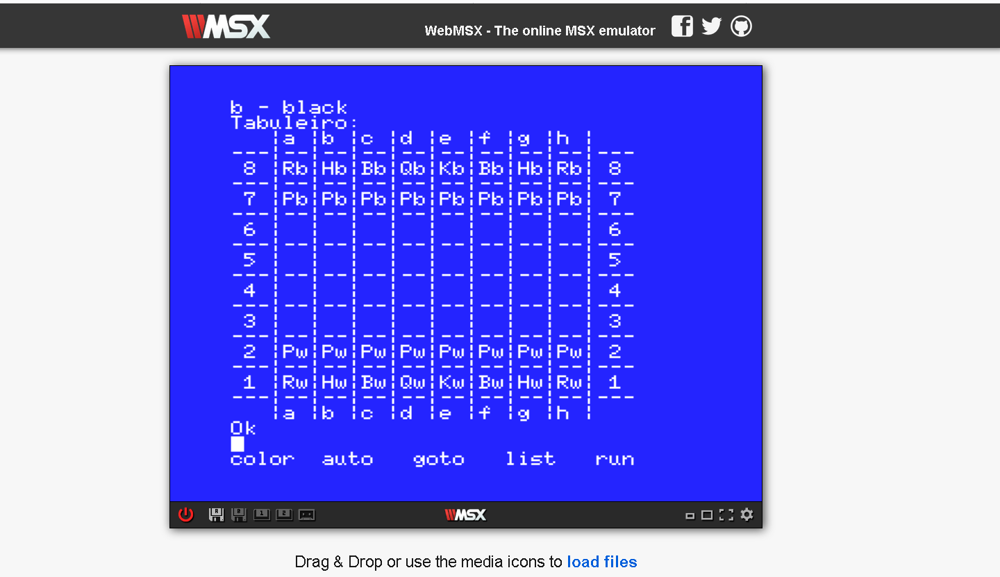

# Basic_Matuchewski
Este repositorio contem o código do MSX BASIC e o pseudocódigo do aluno Matuchewski do tabuleiro de xadrez, programado em baisc no site [WebMSX](https://webmsx.org/)

pseudocódigo:(https://github.com/ProgramacaoEE2020/Basic_Matuchewski/blob/master/pseudocodigoXADREZ_MATUCHEWSKI.txt)

código: (https://github.com/ProgramacaoEE2020/Basic_Matuchewski/blob/master/Codigo%20do%20programa%20Xadrez%20MSX_MATUCHEWSKI.txt)

programa rodando:

